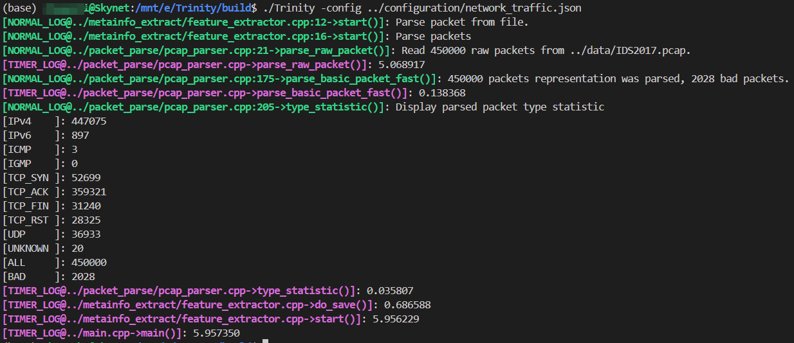
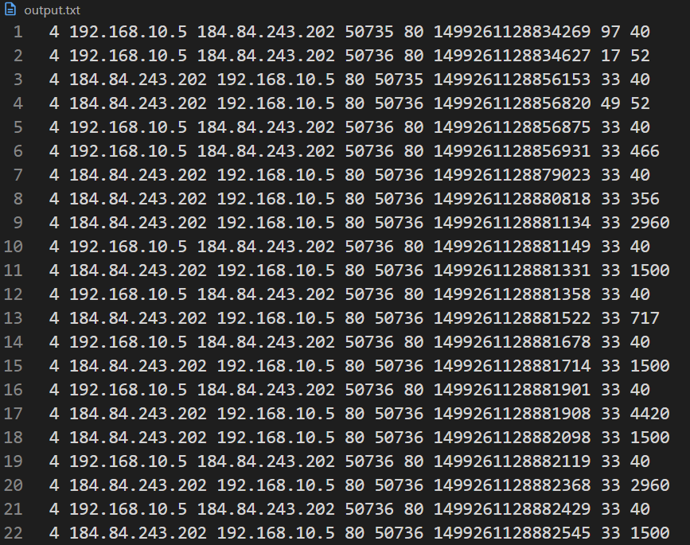

# Trinity：网络数据包元数据提取器

## What is Trinity?

Trinity 用于提取网络数据包元数据。

- 目前可以解析的协议包括：运输层协议（TCP、UDP），网际层协议（IPv4、IPv6、ICMP、IGMP）;
- 提取的数据包元信息有：数据包的源IP地址、目的IP地址、源端口号、目的端口号、协议（映射为一个整数）、包到达时间戳、包长（网际层）;
- 实现__输入无关(Input Agnostic)__的包元数据提取。

## Building Trinity

### 0. 软件准备

0. __安装编译工具链.__	

​	Trinity 在 Ubuntu 20.04/22.04 下完成编译。编译使用的工具有`cmake`+`ninja`+`g++`，运行前使用`apt install`安装正确的编译工具链。

1. __安装LibPcap++.__

​	Trinity 使用 PcapPlusPlus 完成网络包的剖析。依赖包安装地址：[LibPcap++](https://github.com/seladb/PcapPlusPlus/releases/download/v23.09/pcapplusplus-23.09-ubuntu-20.04-gcc-9.4.0-x86_64.tar.gz)。

下面给出简易安装过程，直接运行下面的shell脚本即可完成上述两步：

   ```bash
   $ ./env/install_all.sh
   ```

### 1. 编译

```bash
$ ./init.sh
```

## How do I use Trinity?

### 0. 配置 ../configuration/下的json文件

```json
{
    "packet_parse": {
        "target_file_path": "../data/IDS2017.pcap"
    },
    "result_save": {
        "save_result_enable": true,
        "save_result_path": "../temp/output.txt"
    }
}
```

其中，target_file_path 和 save_result_path 分别表示输入文件与输出文件。

### 1. 运行

```bash
$ cd build

$ ./Trinity -config ../configuration/network_traffic.json
```

### 2. 结果





## Ref.

```
C.Fu, Q. Li, M. Shen, and K. Xu. Realtime robust malicious traffic detection via frequency demain analysis, in Proc. ACM SIGSAC Conf. on Comput. Commun. Secur., pp. 3432-3446, 2021.

C. Fu, Q. Li, and K. Xu, Detecting unknown encrypted malicious traffic in real time via flow interaction graph analysis, in Proc. Netw. Distrib. Syst. Secur. Symp., pp. 1-18, 2023.
```

